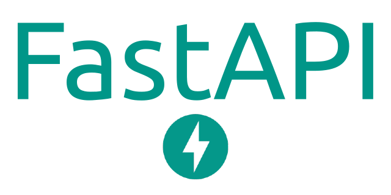
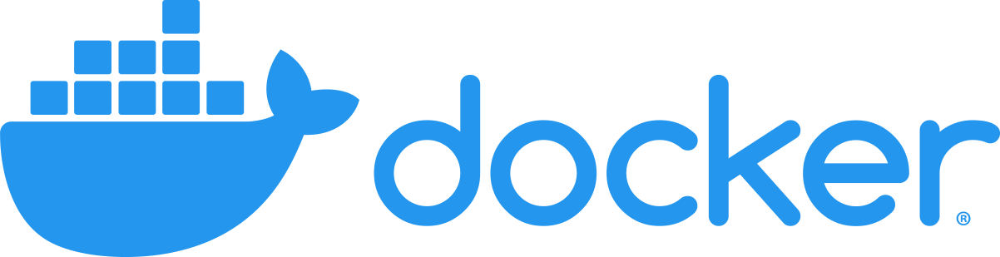

# API de Reconocimiento de Imágenes Basada en Vectores
<p align="middle">
  
  
  
  
  
</p>

El proyecto muestra una solución simple para exponer a través de una API un sistema de reconocimiento de imágenes utilizando un extractor de características (red neuronal de tensorflow desplegada con `tensorflow-serving`) y un motor de búsqueda de similitud vectorial `qdrant`.

## Primeros pasos
Puedes comenzar a explorar el proyecto echando un vistazo a la carpeta `notebooks/`, donde encontrarás varios archivos `.ipynb` que contienen todo lo necesario para entrenar un modelo para tareas de reconocimiento de imágenes. También encontrarás una implementación de `ArcFace` para `tensorflow`.

El proyecto está dividido en tres partes principales: servicios, scripts y notebooks.

Los servicios están compuestos por:
- api: aplicación principal.
- qdrant: Motor de búsqueda basado en vectores.
- tensorflow-serving: API que expone el modelo de tensorflow.

Los notebooks están compuestos por:
- Un notebook para crear un modelo `train_model_arcface.ipynb`

Los scripts permiten las siguientes acciones:
- Inicializar el motor de búsqueda qdrant
- Limpiar el motor de búsqueda qdrant


## Iniciar la aplicación

### Ejecutar la aplicación con Docker
```
docker-compose up
```

El archivo de configuración de la aplicación se describe en `app/default_config.yaml`.


### Alimentar el motor de búsqueda
Ejecuta jupyter y entrena un modelo con `notebooks/train_model.ipynb`. El notebook entrenará un modelo, lo guardará en `storage/models` y creará puntos para alimentar el motor de búsqueda, guardándolos en `storage/collections_resources`.

Luego, ve a la carpeta `scripts/` y ejecuta `create_collection.sh`. (Asegúrate de que las APIs estén en ejecución con `docker-compose up`)
```bash
cd scripts

./create_collection.sh http://localhost:6333 CharactersVectors <path-to-project>/collections_resources Cosine 256
```
Puedes consultar la [Documentación de Qdrant](https://qdrant.tech/documentation/) para entender cómo crear una `Collection` y alimentarla con `Point`.


### Realiza tu primera llamada

```bash
curl \
  -X POST 'http://localhost:8000/api/v1/classifier/predict' \
  --form 'image_file=@"<my-file-path>"'
```

El tipo de archivo debe ser `.png`.

## Usar poetry
### Instalación
Instala Poetry usando `curl -sSL https://raw.githubusercontent.com/python-poetry/poetry/master/get-poetry.py | python -`

El proyecto se ejecuta con `python 3.8.10`. Por lo tanto, necesitas vincular poetry a tu intérprete para permitirle crear un entorno virtual.
```
poetry env use <path-to-python-3.8.10-interpreter>
```

Consulta la [Documentación de Poetry](https://python-poetry.org/docs/) para obtener más información sobre los comandos de poetry.

### Pruebas y linter
Puedes ejecutar la cobertura de pruebas con el siguiente comando:
```bash
poetry run poe test
```

## Flujos de trabajo
### Ejecutar pruebas en PR
Usando la acción [install poetry action](https://github.com/marketplace/actions/install-poetry-action)

## Contribuyentes
<a href="https://github.com/AgRenaud/Vector-Based-Image-Recognition-API/graphs/contributors">
  
</a>

Hecho con [contrib rocks](https://contrib.rocks/).
